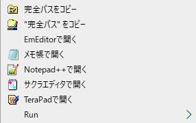
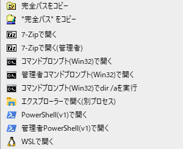
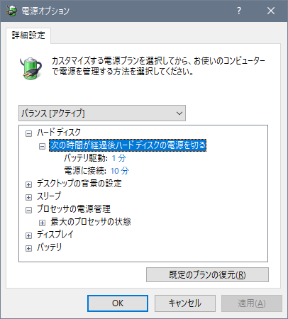

# Better-Windows-public
Windowsをより使いやすくする設定変更のファイル郡です。

## Windows Update
Windows Updateの自動更新の有効/無効をバッチファイルで切り替えます。
バッチファイルを実行した後は再起動が必要です。
グループポリシーを使用するのでPro版以上が必要です。また、管理者権限が必要です。

## アプリの設定
PowerToysの設定をフォルダは  
C:\\Users\\%username%\\AppData\\Local\\Microsoft\\PowerToys  
にコピーする。

## レジストリ
このフォルダーにあるファイルは、レジストリを書き換えて設定を変更します。そのため、管理者権限が必要です。

### エクスプローラーのPCの画面から使わないフォルダーを非表示にします。
3Dオブジェクト非表示.bat  
ビデオ非表示.bat  
ミュージック非表示.bat  

### Windows 11に置いて右クリックしたときのメニュー表示を切り替えます。
右クリック-win11.bat  
デフォルトの設定です。  
右クリック-win10.bat  
Windows10風のメニューになります。  

### Windowsフォトビューアーを有効/無効にします。
win10フォトビューアー.reg  
Windows10でフォトビューアーを有効にします。  
win11-photoviewer_追加.reg  
Windows11でフォトビューアーを有効にします。  
win11-photoviewer＿リセット.reg  
Windows11でフォトビューアーを無効にします。  

### Windows10のウィンドウの表示設定を変更します
win10非アクティブウィンドウの色：白.reg  
win10秒表示.reg  
タスクバーの時計表示に秒を表示させます。  

### キーボードの割当の設定です。
キーボード割当リセット.reg  
キーボード割当変更.reg  
キーボード割当変更.txt  

### エクスプローラーの画面で右クリックしたときに表示されるメニューを編集します。
右クリックメニュー追加.reg  

### 電源プランの設定項目を追加します。
最大のCPU周波数.reg  
次の時間が経過後ハードディスクの電源を切る.reg  
